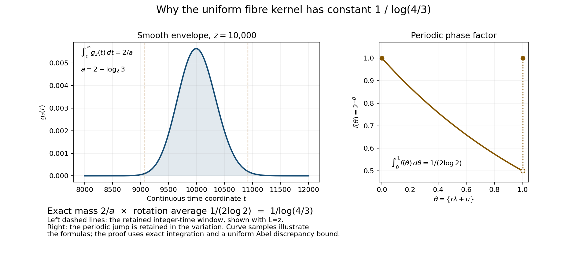

# Conditioning and first-passage fibres in the natural-density argument

This note studies a precise change of sampling measure in the Collatz problem.
Starting at a positive odd integer N, take one **Syracuse step** by applying
3N+1 and then dividing by its full power of two. For a threshold x, the
first-passage value is the first odd iterate at most x. Tao's almost-bounded
orbit theorem is a theorem about logarithmic density. Allikvere's v2
manuscript attempts the corresponding natural-density argument by sampling
uniformly from intervals of odd integers. Uniform and logarithmic sampling
put very different mass near the upper endpoint, so that change needs an
actual calculation.

[Read the complete proof source](audit.tex). The current result goes through
the uniform-input first-passage comparison. The subsequent global
natural-density iteration and quantitative time theorem are still under
review; they are not claimed as established by this note.

## Results and how the arguments fit together

**Retain the offset and the total valuation together.** Let a₁,…,aₙ be
independent positive integers with P(aᵢ=k)=2⁻ᵏ, Sⱼ=a₁+⋯+aⱼ, and
Xₙ=Σᵢ₌₁ⁿ 3ⁱ⁻¹2⁻ˢⁱ modulo 3ⁿ (the inverse of 2 is taken in that ring).
The joint law of (Xₙ,Sₙ) differs by O_A(m⁻ᴬ), for every A>0 and every
1≤m≤n, from the law obtained by reducing the residue modulo 3ᵐ and
spreading each mass uniformly over its refinements modulo 3ⁿ, while
retaining Sₙ. The proof uses Tao's positive Fourier majorant, a stopping
split, and exact convolution in the total coordinate. Keeping that
coordinate avoids assuming that unconditional Fourier cancellation
survives conditioning.

For |s−2n|≤C√(n log n), conditioning on Sₙ=s consequently gives, for
every fixed 0<ε<0.9 and n^ε≤m≤n^0.9,

~~~text
Σ(z mod 3^n) |P(X_n=z | S_n=s) − 3^(m−n) P(X_m=z mod 3^m)|
    = O_(A,C,ε)(m^(−A) + √(m log n/n)).
~~~

The second term comes from an explicit comparison of the conditioned
coarse block with independent geometric variables. This includes
Allikvere's stated n^0.25≤m≤n^0.5 range and extends it.
Proofs: prop:joint-mixing, cor:fixed-total, lem:coarse-tilt, cor:product.

**Control the actual integer input window.** A valuation word determines
one odd residue class and an exact affine inverse. Moving its input
endpoint by the affine offset must be counted, not discarded. The
elementary separation lemma says that if R≥1, M>4·3^(2R) and v>0, then
at most one pair (r,s), with 1≤r≤R and s an integer, satisfies

~~~text
M − 3^r ≤ v·3^r·2^(−s) ≤ M.
~~~

Two incidences would force unequal positive integers 3^q and 2^p to
differ by less than one. Together with the exact cylinder counts and
the harmonic-weight bound, this gives endpoint replacement error
O((log x)^(-1/2)), without a logarithmic-form estimate **at this step**.
The source's bound at this step is (log x)^(-1/2+o(1)).
Proofs: lem:one-endpoint, prop:window-cost.

**Evaluate the counting kernel without freezing its weights on blocks.**
Put L=log x, α=1.001, d=log(4/3), m₀=⌊L/100000⌋,
λ=log₂3, and y=x^α or x^(α²). Prefix lengths r run through the integers in

~~~text
[log(y/x)/d + L^(4/5) − m₀,
 log(y^α/x)/d + L^(4/5) − m₀].
~~~

For every real M in [x exp(dm₀−L^(7/10)), x exp(dm₀+L^(7/10))],
set u=log₂(y^α/M), u₀=log₂(y/M) and

~~~text
D_y(M) = Σ_r 3^(−r) Σ_(rλ+u₀ < s ≤ rλ+u) binom(s−1,r−1).
~~~

Binomial terms with s<r are zero. Then, uniformly over this entire band,

~~~text
D_y(M) = y^α / (M log(4/3)) · (1 + O_(α,c)(L^(−c)))
for every fixed 0<c<1/17.232; in particular c=1/18.
~~~

Exact binomial summation gives a smooth envelope and the phase factor
2^(-{rλ+u}). The envelope has integral 2/(2−λ), while the phase average
is 1/(2 log 2); their product is 1/log(4/3). Summation by parts retains
the endpoint jumps and uses the envelope's O(L^(-1/2)) total variation.
With the same Rhin input, it changes the source argument's exponent
ceiling from 1/(2(8.616+1)) to 1/(2·8.616). This is a comparison with
that proof, not a claim that the exponent is best known.
Proofs: lem:abel-rotation, lem:envelope-mass, prop:kernel-leading.

The envelope curve is a numerical sample at z=10000; the integral and
constant are proved, not inferred from the plot. The phase plot retains
the jump at an integer.

**Pass from the kernel to the actual first-passage law.** Sample N
uniformly from the odd integers in either [x^α,x^(α²)] or
[x^(α²),x^(α³)]. With the first-passage value set to 1 on a trajectory
that never reaches x, the two laws differ in ℓ¹ by O_c((log x)^(-c))
for every fixed 0<c<1/17.232. Each failure event has probability O(x^(-η))
for some η>0. More precisely the proof constructs one probability Qₓ
to which both laws are that close. It first controls the entire
counting measure, proves the common profile's total mass is
1+O_c((log x)^(-c)), and only then divides by that proved positive mass.
This reconstructs Allikvere's uniform first-passage theorem with the
stronger component rate propagated to its conclusion.
Proofs: lem:uniform-input, prop:actual-reduction, cor:uniform-stabilisation.

## Sources and attribution

- [Terence Tao, *Almost all orbits of the Collatz map attain almost bounded
  values*, arXiv:1909.03562v7](https://arxiv.org/abs/1909.03562v7).
  Proposition 1.9 supplies the geometric valuation comparison;
  Section 5 supplies the deterministic passage mechanism; Sections 6–7
  supply the stopping split and positive majorant. Tao's logarithmic-density
  theorem is not being represented as a natural-density theorem.
- [Jaan Allikvere, *Almost all Collatz orbits attain almost bounded values
  in natural density*, v2](https://doi.org/10.5281/zenodo.21499244).
  The uniform sampling measure, extended time interval, conditioned
  comparison and kernel formulation are his. Exact source labels and
  line locators are in [CLAIMS.json](CLAIMS.json).
- [Georges Rhin, *Approximants de Padé et mesures effectives
  d'irrationalité* (1987)](https://doi.org/10.1007/978-1-4757-4267-1_11),
  proposition (8), p.160. Its published logarithmic-form bound is an input,
  not a new certificate of the auxiliary-polynomial computation.
- L. Kuipers and H. Niederreiter, *Uniform Distribution of Sequences*
  (Wiley, 1974), Chapter 2, Theorem 2.5, pp.112–114, and Theorem 5.1,
  p.143: the Erdős–Turán and Koksma inequalities.
- [Workbench coefficient proof](../../preprints/tao_clock_audit/sections/repairs.tex):
  the exact low/high-valuation summation is valid for every integer
  m₀≤n≤n₀, including the extended window.

This is human–LLM collaborative work in PolyClank. The present audit and
refinements were written with GPT-6 Astra, Ultra mode in Codex. The earlier
coefficient reconstruction was developed with GPT-5.6 Sol, Ultra mode in
Codex. No historical priority or external peer-review claim is made.

## Reproduce and review

~~~text
python check_exact.py --output replay.json
~~~

The checker uses the Python standard library, runs serially, makes no
network request and refuses optimized Python with assertions disabled.
It checks exact integer and rational identities, residue histograms,
endpoint incidence, the envelope coordinate change and probability-mass
identities. It also verifies all local theorem labels and claim locators.
It does not prove the infinite analytical estimates or certify the entire
natural-density argument in Lean.

Original source TeX can optionally be hash-checked using --tao-source
and --allikvere-source; the exact version hashes are in CLAIMS.json.
Without these options the report explicitly records that external-source
hash checking was not requested. Protected literature is cited at its
original source, not bundled here. The --local-state option is only
for the originating corpus and is not needed to reproduce the public
finite checks.

To build the proof source, run pdflatex audit.tex twice in this directory.
The explanatory image is reproducible with
python draw_kernel_mechanism.py and Matplotlib.

To contribute, fork [the workbench](https://github.com/KokunoYumeto/collatz-workbench),
make a branch, add or amend the relevant proof and checks, and open a pull
request against main. For a question or counterexample that is not yet
a patch, open an issue and identify the statement and version being discussed.
