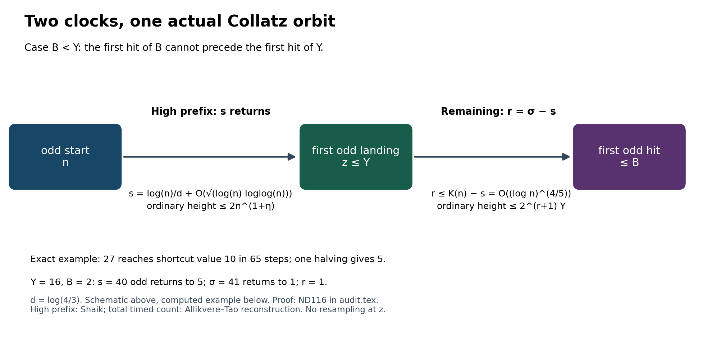

# Collatz first passage, natural density, clocks and height

This working paper reconstructs how a Collatz orbit reaches a smaller target,
how long that passage takes under the different conventions for counting steps,
and how large the orbit can become before the passage ends. It develops the
source comparisons into complete written arguments, with exact arithmetic
checks and separately scoped Lean certificates.

Read the [168-page PDF](audit.pdf), or use its [complete LaTeX source](audit.tex). This edition is dated **30 September 2026**. The current PDF was compiled in the existing Overleaf project and checked for errors, cross-references and page overflow; the main theorem, proof, repaired displays and bibliography were visually inspected. The [build record](PDF_QA.json) identifies the source and PDF by hash.

## A common path with three clocks

The ordinary map is C(n)=n/2 for even n and C(n)=3n+1 for odd n.
The shortcut map replaces an odd step by (3n+1)/2. On odd integers, the
Syracuse map divides 3n+1 by its entire power of two. Thus an orbit has
different ordinary, shortcut and odd-return clocks; the comparison must
follow the actual same orbit.

Put d=log(4/3), with natural logarithms. For every beta,e>0 there is a
constant A=A(beta,e), independent of B,c,X, with the following property.
For every X>=2, integer B>=2 and 0<c<1/17.232, all but at most

**C_c X(log B)^(-c) + C_(beta,e) X(log(X+2))^(-e)**

positive starting integers n<=X have one orbit prefix ending at an odd
integer <=B, with the simultaneous bounds

| Quantity along that same prefix | Upper bound |
|---|---|
| Number of odd steps (Syracuse returns when n is odd) | log(n)/d + A log(n+2)^(4/5) |
| Shortcut steps | 2 log(n)/d + A log(n+2)^(4/5) |
| Ordinary steps | 3 log(n)/d + A log(n+2)^(4/5) |
| Largest ordinary value, including n | n^(1+beta) |

Consequently, for every real-valued f(n) tending to infinity, these same
clock and height bounds reach a value **strictly below f(n)** on a set of
natural density one. The clock does not depend on f. This is an
almost-everywhere assertion, not convergence of every Collatz orbit.

**Why the combination works.** The reconstructed high-prefix argument reaches
an odd z below a polylogarithmic threshold Y after
s=log(n)/d+O(sqrt(log n log log n)) odd returns. Independently, the reconstructed
timed-target count bounds the first odd hit of B by
K=log(n)/d+O(log(n)^(4/5)). If B<Y, the remaining number of actual returns
is r<=K-s=O(log(n)^(4/5)); if B>=Y, truncate the high prefix.
For the remaining r returns from z, the exact valuation telescope gives
shortcut length <=2r+log2(z), ordinary length <=3r+log2(z), and ordinary
tail height <=2^(r+1)Y. The latter is exp(O(log(n)^(4/5))) and eventually
less than n. Both good sets concern the original n, so their exceptional
counts may be added without assuming independence or resampling at z.

Proof locators in the TeX: **lem:shaik-high-two-sided**,
**lem:shaik-same-orbit-tail**, **thm:shaik-allikvere-drift-target**.
The machine-readable result is ND-116 / CLM-COL-000309 in [CLAIMS.json](CLAIMS.json).



## Where this sits in the literature

[Tao's v7 paper](https://arxiv.org/abs/1909.03562v7) establishes almost-bounded
orbit minima in logarithmic density and supplies the first-passage/Fourier
method used here. [Allikvere's v2 manuscript](https://doi.org/10.5281/zenodo.21499244)
develops the uniform-input and timed natural-density argument.
The workbench reconstructs that iteration after proving joint offset–valuation
mixing, exact first-passage fibres and the uniform kernel estimate.

[Idris Ali Shaik's v3.2.4 manuscript](https://zenodo.org/records/22130385)
and [pinned Lean source](https://github.com/shaikidris/FirstPassageLinearTransport/tree/ef3410843bf58d69f771f5ba2c0571d54b54da59)
provide the complementary parity/transport construction for the high prefix.
The present synthesis uses that prefix and Allikvere's total odd-clock witness
on the same deterministic orbit. It improves the earlier crude ordinary bound
(3/d+1/log 2)log(n)+O(log(n)^(4/5)) by removing the extra log2(n);
that earlier telescope remains correct.

The coefficients 1/d,2/d,3/d are not new predictions.
[Manuel Inselmann's v3 paper](https://arxiv.org/abs/2402.03276v3),
particularly Theorems 1.1, 1.9 and 1.10, gives earlier trajectory envelopes
with these drift clocks and fixed power tolerances. The displayed result
retains the explicit sublinear time error while reaching every diverging
target and controlling the height of the same path. No priority claim or
correction to Tao's theorem is made.

The manuscript also treats [Lech Mazur's v2 argument](https://www.proofatlas.ai/formalizations/natural-density-log-time-collatz/):
the terminal scalar error, exact finite interval comparisons, rank and mass
constraints, and the passage from terminal estimates to count and clock
bounds. Its complete formal package has not been independently replayed here.

## Other results in the reconstruction

- Joint offset–total-valuation mixing retains the total rather than averaging
  it away. The conditioned estimate is extended to n^epsilon<=m<=n^0.9,
  with the coarse-conditioning error explicitly retained.
- Elementary integer separation controls the first-passage endpoint error
  by O((log x)^(-1/2)). Summation by parts then yields the kernel exponent
  c<1/17.232 using the same Rhin Diophantine input, and the scale iteration
  carries it to the timed fixed-target count above.
- The Mazur comparison sharpens its terminal scalar majorants while retaining
  the complete exponential, finite cutoffs, exact integer fibres and mass.
- For Shaik's completed shortcut blocks, if x lies in [2^m,2^(m+1)),
  the block has h<=m steps and endpoint y<=2^q, the pointwise bound is
  T^v(x)<=min(floor(3^v(x+1)/2^v)-1,2^(h-v)y), 0<=v<=h.
  An exact integer crossing evaluates the corresponding shell maximum using
  two candidates. This discrete result has a matching Lean certificate.
- The timeout low-stage duration sets are computed exactly, including gaps
  and the distinct dyadic branch. For the displayed parameters L=20,K0=4
  and entry p=64, the resulting reserve is 323 rather than the triangular
  bound 1826, including terminal halvings. These are finite-stage refinements,
  not a new leading drift coefficient.

Each statement has its hypotheses, proof, source locator and dependence
record in the manuscript and [claim list](CLAIMS.json). The figures are
schematics or specified numerical samples, not substitutes for those proofs.

## Checks and reproducibility

From this directory in a copy of the repository, the two self-contained
entry points require Python's standard library:

```text
python check_exact.py --output checks.json
python check_shaik_allikvere_splice.py
```

Both were rerun against the distributed files. The second checks exact
reverse products, 34,880 high passages, 129,413 continuations, 119,639
truncations and 1,764 valuation-fibre counts, including zero-return tails.
These are finite regressions, **not proofs of the analytic density theorem**.

All 33 finite suites passed in the local source workbench.
The other checkers include source-content and hash checks and therefore
also need the authors' pinned source archives in their stated relative
locations. Their original outputs are retained in **local_receipts/**,
clearly labelled as local runs. They are not presented as self-contained
public-package replays. The distributed claim list omits machine-local
paths; those reports retain the original local input hashes under
local_artifact_hashes.

Five independent Lean source modules are included: clock/rank identities,
joint witnesses, reflection counts, dyadic prefix counts, and completed-block
heights. [Formal replay notes](FORMAL_REPLAY.md) state their exact scope and
imports. Existing certificate integrity was rechecked; no Lean compiler was
launched for this publication. These modules do not formally certify the
real analytic density argument.

## PolyClank collaboration

This is an ongoing human–LLM research workbench. The present reconstruction
was developed with GPT-6 Astra in Ultra mode in Codex; earlier work used
ChatGPT 5.6 Sol, Ultra mode in Codex. Human literature authors retain their
own attribution.

To contribute, fork [the repository](https://github.com/KokunoYumeto/collatz-workbench),
have your model read the proofs and cited sources, and commit its mathematical
arguments and reproducible checks to your fork. Link the work in the
[PolyClank discussion](https://www.reddit.com/r/PolyClank/comments/1wslv90/polyclank_auditing_the_collatz_literature_and/);
a pull request is also welcome. Other workbenches can then compare the actual
arguments and integrate useful results with attribution. A complete, readable
proof is more useful than a report that a model accepted the claim.

